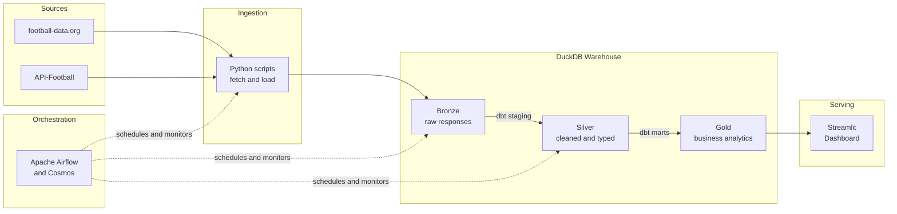

# football-analytics-pipeline

> Production-grade Premier League data pipeline. Raw API responses land in Bronze, dbt transforms them through Silver into Gold analytics, Apache Airflow orchestrates the full run daily. A Streamlit dashboard serves the results.

[](https://github.com/guisefe/football-analytics-pipeline/actions)
[](https://python.org)
[](https://getdbt.com)
[](https://airflow.apache.org)
[](https://duckdb.org)
[](LICENSE)

---

## Architecture



---

## What this project demonstrates

- **End-to-end ownership** — from API ingestion to served dashboard, every layer built and connected
- **Idempotent pipeline** — running twice produces the same result; no duplicates, no drift
- **Retry logic** — transient failures retry 3 times before alerting; the pipeline does not need babysitting
- **Data quality as code** — dbt tests run on every model, every day; bad data is caught before it reaches the dashboard
- **Model-level observability** — Cosmos turns every dbt model into an Airflow task, giving individual retry, logging, and monitoring per transformation
- **Reproducible environment** — `make init && make up` is all it takes; no manual steps, no undocumented dependencies

---

## Data sources

| Source | Endpoint | Data |
|---|---|---|
| [football-data.org](https://football-data.org) | `/competitions/PL/matches` | 380 matches — scores, dates, matchdays |
| [football-data.org](https://football-data.org) | `/competitions/PL/scorers` | Top 50 scorers |
| [football-data.org](https://football-data.org) | `/competitions/PL/standings` | Final table, 20 teams |
| [football-data.org](https://football-data.org) | `/teams/{id}` | Full squad per team |
| [API-Football](https://api-football.com) | `/players/topscorers` | Goals, assists, minutes, shots per player |
| [API-Football](https://api-football.com) | `/players/topassists` | Assists, key passes per player |

Both APIs provide a permanent free tier — no credit card required.

---

## Key engineering decisions

**DuckDB instead of a cloud warehouse**
The full Premier League dataset fits comfortably in memory. A cloud warehouse would add cost, latency, and credential complexity without any benefit at this scale. DuckDB processes the same analytical queries in milliseconds, runs inside Docker with no server, and makes the project fully reproducible in CI without cloud dependencies.

**dbt for transformations**
SQL transformations without dbt are undocumented, untested, and hard to reason about across layers. dbt brings version control, automated tests, column-level documentation, and lineage — the same practices applied to application code, now applied to data models.

**Cosmos for Airflow and dbt integration**
A single `dbt run` command in a BashOperator gives no observability — one model fails and you see one red task. Cosmos parses the dbt project and creates one Airflow task per model, with individual retry, logging, and dependency tracking. The DAG graph is the lineage graph.

**DuckDB single-writer pool**
DuckDB supports concurrent reads but serializes writes. Without a pool, parallel Airflow tasks would compete for the write lock and fail unpredictably. A pool with one slot ensures tasks write sequentially without sacrificing the parallelism of the ingestion phase.

**`profiles.yml` inside the project**
Airflow runs inside Docker with no access to `~/.dbt/`. Keeping the profile in the repository makes the environment self-contained — `docker compose up` is the only setup step.

---

## Project structure

```
football-analytics-pipeline/
├── ingestion/                  # Bronze — Python ingestion scripts
│   ├── config.py               # All constants and API configuration
│   ├── db.py                   # DuckDB connection and Bronze writer
│   ├── fetch_matches.py
│   ├── fetch_scorers.py
│   ├── fetch_standings.py
│   ├── fetch_squads.py
│   └── fetch_player_stats.py
├── dbt/                        # Silver + Gold — dbt transformations
│   ├── dbt_project.yml
│   ├── profiles.yml            # Inside project — Docker compatible
│   └── models/
│       ├── staging/            # Silver: cleaned, typed, 1:1 with source
│       └── marts/              # Gold: business-ready analytics
├── dags/
│   └── pl_pipeline.py          # Airflow DAG with Cosmos dbt integration
├── app/
│   └── streamlit_app.py
├── .github/
│   └── workflows/ci.yml        # Tests and lint on every push
├── docker-compose.yml
├── Dockerfile                  # Airflow image extended with dbt and Cosmos
├── Makefile                    # Standardized dev commands
└── .env.example
```

---

## Quickstart

### Requirements

- [Docker](https://docs.docker.com/get-docker/) and Docker Compose
- Free API key from [football-data.org](https://www.football-data.org/client/register)
- Free API key from [API-Football](https://dashboard.api-football.com/register)

### Setup

```bash
git clone https://github.com/guisefe/football-analytics-pipeline.git
cd football-analytics-pipeline

cp .env.example .env
# Fill in FOOTBALL_DATA_API_KEY and API_FOOTBALL_KEY
```

### Run

```bash
make init   # First run only — initializes Airflow DB and creates DuckDB pool
make up     # Starts webserver + scheduler
```

Airflow UI at [localhost:8080](http://localhost:8080) — `admin / admin`.

Trigger `pl_pipeline` manually or wait for the 6am UTC schedule.

### Dev commands

```bash
make dbt-run    # Run dbt models
make dbt-test   # Run data quality tests
make lint       # Lint SQL with sqlfluff
make test       # Run Python unit tests with coverage
make logs       # Stream scheduler logs
make clean      # Tear down everything including volumes
```

---

## Pipeline DAG

```
fetch_matches ──┐
fetch_scorers ──┤
fetch_standings─┼──▶ dbt staging models ──▶ dbt mart models
fetch_squads ───┤         (Silver)               (Gold)
fetch_player ───┘
```

Ingestion tasks run in parallel. dbt tasks run sequentially through the single-writer pool. Each dbt model is a separate Airflow task with individual retry and logging.

---

## dbt models

### Staging — Silver

| Model | Description |
|---|---|
| `stg_matches` | Flat, typed match records. Adds `result` (HOME_WIN / AWAY_WIN / DRAW) and `total_goals`. |
| `stg_scorers` | Extracts player and team fields. Computes `non_penalty_goals`. |
| `stg_standings` | Extracts team fields. Computes `win_rate` and `avg_goals_for`. |
| `stg_squads` | One row per player. Explodes nested squad array. |
| `stg_player_stats` | Flattens nested stats. Extracts minutes, shots, key passes, cards. |

### Marts — Gold

| Model | Business question answered |
|---|---|
| `standings_enriched` | Where did each team finish, and what was their form in the last 5 matches? |
| `top_scorers` | Who were the most productive attackers beyond just raw goals? |
| `team_form` | Which teams were improving or declining at the end of the season? |
| `player_analysis` | Who contributed most per 90 minutes played? |

---

## Data quality

Every staging and mart model has tests in `schema.yml`:

- `not_null` on all primary and foreign keys
- `unique` on all primary keys
- `accepted_values` on categorical columns like `result`
- `relationships` between staging and mart models

Tests run in CI on every push. A failing test blocks the merge.

---

## Author

**Guilherme Senis** — Data & AI Engineer

[GitHub](https://github.com/guisefe) · [LinkedIn](https://linkedin.com/in/guilherme-senis) · [Email](mailto:gui.senis635@gmail.com)